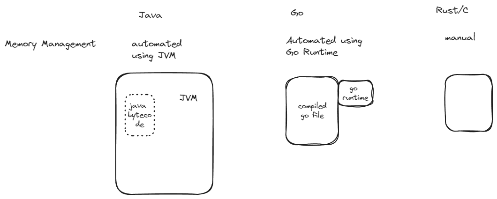
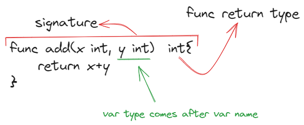

# Table of Contents

- [Table of Contents](#table-of-contents)
- [Go Comparision with other Programming languages](#go-comparision-with-other-programming-languages)
- [Some Go Basics](#some-go-basics)
- [Go Lang Basic Syntax](#go-lang-basic-syntax)
  - [Types in Go Lang](#types-in-go-lang)
  - [Constants in Go](#constants-in-go)
  - [User Input in Go Lang](#user-input-in-go-lang)
  - [Conversions in GO Lang](#conversions-in-go-lang)
  - [FORMATTING STRINGS IN GO](#formatting-strings-in-go)
  - [Story of Time in GO Lang](#story-of-time-in-go-lang)
  - [Building for Windows, Linux, Mac](#building-for-windows-linux-mac)
  - [Memory Management in GO Lang](#memory-management-in-go-lang)
  - [Pointers](#pointers)
  - [Arrays in Go Lang](#arrays-in-go-lang)
  - [Slices in GO Lang](#slices-in-go-lang)
  - [Maps in Go Lang](#maps-in-go-lang)
    - [Using Struct Pointers as Map Keys](#using-struct-pointers-as-map-keys)
    - [⚠️ Concurrency Warning:](#️-concurrency-warning)
  - [Structs in GO Lang](#structs-in-go-lang)
  - [Conditionals](#conditionals)
    - [THE INITIAL STATEMENT OF AN IF BLOCK](#the-initial-statement-of-an-if-block)
  - [For loop](#for-loop)
  - [Functions](#functions)
  - [Methods](#methods)
  - [Defer in GoLang](#defer-in-golang)
  - [Working with files in GO Lang](#working-with-files-in-go-lang)
  - [Handling Web Request in Go Lang](#handling-web-request-in-go-lang)
    - [`net/http` package](#nethttp-package)
    - [using the `url` package](#using-the-url-package)
    - [Go Mod](#go-mod)
      - [building a basic server in Go](#building-a-basic-server-in-go)
- [Building APIs in golang](#building-apis-in-golang)

# Go Comparision with other Programming languages

[ToC](#table-of-contents)

Execution & Compilation speeds comparision

Execution speeds :
faster than JS, py, ruby, php

Compilation speeds : faster compile times than rust, c, c++, java, c#

GO is fasrter that java, but slow than c,c++,rust.

Compairing GO with natively compiled Langs(ex : C, C++, Rust) Vs compiled Langs which run on top of a VM(ex : Java, C#).

> GO is natively compiled on the system but it's execution speed is slower than others like Rust, c, c++, but is similar to other compiled langs which run on VM. <br>
> Reason : GO Runtime(a chunk of code that's included in every go code that manages memory which tends to slow down the execution speed, but it tends to use less memory than langs compiled & executed on vm).
>
> Go does not have operator, method overloading, do not have class & object but have structs

Textio Server.

main.go &rarr; compile it(go build) &rarr; main.exe

Go performance in memory management.

Rust / C has manual memory management

Java memory management is automated.
It has auto garbage collector.
Every time we run a java prog we create a mini JVM within which our java byte code runs. the JVM takes care of all the memory management like allocating & de-allocating all the memory that we use.

Go is in between C & Java in terms of memory management.

- It has a automated garbage collector
- It does not have a VM like JVM where we run our bytecode but like rust & c we get a single binary.
- Go includes a `Go Runtime` withing any binary that is built using go prog lang.
- This extra code for `Go Runtime` handles garbage collection and automated memory management.
- Go has more .exe file size than Rust or C but has much less memory overhead(VM) than Java or C# while providing the garbage collector



Memory Efficiency order

Rust > GO >>> Java

Go Runtime cleans up unused memory.

# Some Go Basics

[ToC](#table-of-contents)

```go
fmt.Println(time.Now())
```

`go mod init` a command kind of similar to `npm init`
`go mod init hello` running inside `01hello` folder generates a go.mod file under `01hello` folder which containg following
we need to run `go mod init hello` command first & then only go to `main.go` file and start working as that is the way forward for production ready stuff.

```go
module hello

go 1.22.4
```

this says that module name is `hello` and go version is `1.22.4`

go is similar to c & c++ in sense that it has an single entry point `main()` function where `main` is a reserved keyword.

GOPATH is the location where go is installed we can check it via `go env GOPATH`
on navigatig to there, say:

```go
-go
   -bin
      -gopls.exe* ,  gopls.exe~* ,  staticcheck.exe*
   -pkg
      - mod/
         - cache/ , github.com/ ,  golang.org/ , honnef.co/ , mvdan.cc/
      - sumdb/
         - 
```

The formal grammar of go lang has semi-colon `;` at end of every line like it is in c/c++ but the Lexer(a tool which handles the pre-Compilation part and checks for proper grammar and syntax of the program for a language like in c/c++/java)

The lexer automatically puts a `;` at the end of a line so we do need to put it there and even though we put it then also vscode intellisense removes that semi-colon at end of line, the semi-colon is put by Lexer at time of Lexical Analysis.

# Go Lang Basic Syntax

[ToC](#table-of-contents)

`func main()` is entry point of eveyr go program

## Types in Go Lang

[ToC](#table-of-contents)

types are case sensitive and it also help to define that if a var/func is going to be `Public` or `private`
The initial letter of var/func gives the idea of wether it is Public or private.
ex : `Println` here its `P` hence it is exported as a Public method.

variable type should be known in advance

> <u>***In Go almost everything is a `Type` , just like everything in JS is an Object***</u>

```go
bool

string // sequence of runes

int  int8  int16  int32  int64
uint uint8 uint16 uint32 uint64  // unisgned int starts from 0
uintptr

byte // alias for uint8

rune // alias for int32
     // represents a Unicode code point
     // single character in unicode format

float32 float64  // float32 can have 5 digits after decimal and last 5th digit is rounded off.
// float64 can have 9 digits after decimal

complex64 complex128  // imaginary numbers

fmt.printf("%v %.2f %v %q\n") // %v default format, %.2f floating point with 2 decimal places, 
// %T for type of a var

//Advanced Types
Array, Slices, Maps, Structs, Pointers
Functions // they are also `Type` so that they can be passed in a func & returned from one
Channels, Mutex
```

The value of a declared variable with no assignment will be its zero value.

The zero value is:

- `0` for numeric types (`int`, `float`),
- `false` for the `boolean` type, and
- `""` (the empty string) for `strings`.

declaring the variables

```go
var varName int
// this will be set to zero value 0
```

Implicit Type declaration :

```go
var website = "go.dev"

var a = false // lexer will boolean 
```

Here the lexer kicks in and decides the type of the variable based on the literal that is provided to it for the very first time. But the type will remain fixed for the entire program and assigning other type value will give error.

No Var Style

```go
varName := 0

i := 10
f := 3.141
s := "string"
b := true

// When the right hand side is a literal value the new variable will be an int, float64, or complex128 depending on its precision:

i := 42           // int
f := 3.14         // float64
g := 0.867 + 0.5i // complex128

// multiple variables in same line : 

mileage, company := 80276, "Tesla"
// is same as 
mileage := 80276
company := "Tesla"
```

The `:=` operator is only allowed inside a method, it is not allowed for global variable, for that we need to use `var` style.

```go
temperatureFloat := 88.26
temperatureInt := int64(temperatureFloat)
// Casting a float to an integer in this way truncates the floating point portion.
```

```go
// Unless you have a good reason to, stick to the following types:
bool
string
int
uint
byte
rune
float64
complex128
```

## Constants in Go

[ToC](#table-of-contents)

> Constants are declared with the const keyword. They can't use the := short declaration syntax.
`const pi = 3.14159`
>
> `Constants` can be `character`, `string`, `boolean`, or `numeric` values. They can not be more complex types like `slices`, `maps` and `structs`.
>
> Constants ***must be known at compile time*** \
> However, constants can be computed as long as the computation can happen at compile time.
> We cannot declare a constant that can only be computed at run-time like we can in JavaScript
>
> ```go
> const myInt = 15
> const firstName = "Lane"
> const lastName = "Wagner"
> const fullName = firstName + " " + lastName
> // below is invalid 
> // the current time can only be known when the program is running
> const currentTime = time.Now()
> ```

if we write like

```go
package main

import "fmt"

const LoginToken = "hiurhgfuiehrnvi"
// here note that in above const the 1st letter is Capital, 
// hence it is PUBLIC in Go lang
// in other langs we need to write `public` keyword but here only 1st letter in Caps is enough.

func main() {
   var username string = "adarsh"
   fmt.Println(username)
   fmt.Printf("var is of type : %T \n", username)

   fmt.Println(LoginToken)
   fmt.Printf("var is of type : %T\n", LoginToken)
   /*O/P
   adarsh
   var is of type : string
   hiurhgfuiehrnvi
   var is of type : string
   */
}
```

## User Input in Go Lang

[ToC](#table-of-contents)

`bufio` and `os` package

```go
func main() {
   reader := bufio.NewReader(os.Stdin)
   // do note that here `NewReader` has `N` & `Stdin` has `S` hence they are public
   fmt.Println("Enter rating for our pizza :") // println auto adds a \n at end

   // `, ok syntax` || `err ok syntax`

   // The paradigm of the language is that it expects err to be treated like a var/bool

   input, _ := reader.ReadString('\n') // reads until the first occurrence of delimeter(here `\n`) in the input.
   fmt.Println("Thanks for rating", input)
   fmt.Printf("Type of rating is %T", input)
   // note that err is not used here so we can use `_` as a var name here and it will not show `Declared but not user` error
}
```

## Conversions in GO Lang

[ToC](#table-of-contents)

```go
// inside main()
   reader := bufio.NewReader(os.Stdin)
   ip, _ := reader.ReadString('\n')
   fmt.Println("Thanks for your rating : ", ip)
   numRating, err := strconv.ParseFloat(ip, 64)
   if err != nil {
      fmt.Println("some error ->", err)
   } else {
      fmt.Printf("var type is %T", numRating)
   }
/*
It will return an error at this point like : 
some error -> strconv.ParseFloat: parsing "3.5\r\n": invalid syntax
*/
```

Note that here we are having extra `\r\n` at the end of string, & to solve this we have to trim it.
By using `strings.TrimSpace()` package to return Slices of string after removing leading & trailing whitespaces.

```go
   fmt.Println("Please rate our pizza b/w 1 & 5")
   reader := bufio.NewReader(os.Stdin)
   ip, _ := reader.ReadString('\n')
   fmt.Println("Thanks for your rating : ", ip)
   // converting rating to number
   numRating, err := strconv.ParseFloat(strings.TrimSpace(ip), 64)
   if err != nil {
      fmt.Println("some error ->", err)
   } else {
      fmt.Printf("var type is %T", numRating)
   }
```

## FORMATTING STRINGS IN GO

[ToC](#table-of-contents)

- `fmt.Printf` - Prints a formatted string to standard out.
- `fmt.Sprintf()` - Returns the formatted string

```go
// %v is the default for any data type
s := fmt.Sprintf("I am %v years old", 10)
// I am 10 years old

s := fmt.Sprintf("I am %v years old", "way too many")
// I am way too many years old

// %T is for printing type
const name = "Saul Goodman"
const openRate = 30.5
var msg = fmt.Sprintf("Hi %s, your open rate is %.1f percent\n",name,openRate)
```

## Story of Time in GO Lang

[ToC](#table-of-contents)

```go
// inside main
presentTime := time.Now()
// note that the Format func contains exact time value and will return the formatted time of the time on which the function is used
fmt.Println(presentTime.Format("02-01 Monday 2006 15-04-05")) // 25-06 Tuesday 2024 12-15-51
fmt.Println(presentTime.Format("02-01-2006 Monday  15:04:05")) // 25-06-2024 Tuesday  12:19:53


fmt.Printf("presentTime type is %T\n", presentTime)// presentTime type is time.Time
formattedPresentTime := presentTime.Format("02-01-2006 Monday  15:04:05")
fmt.Printf("formattedPresentTime type is %T\n", formattedPresentTime) //formattedPresentTime type is string
```

Creating time in Go

```go
createdTime := time.Date(2024, time.October, 19, 2, 45, 20, 0, time.UTC)
fmt.Printf("createdTime type is %T", createdTime)
fmt.Println(createdTime)
```

- Note that here we need to pass Month & location in proper format and rest are `int` only
- `time.Now().UnixNano()` : UnixNano returns t as a Unix time, the number of nanoseconds elapsed since January 1, 1970 UTC.

## Building for Windows, Linux, Mac

[ToC](#table-of-contents)

- `go env` shows up all the system env variables
- `GOOS` env var is for building the executable for different os.
- `GOOS="linux" go build`

## Memory Management in GO Lang

[ToC](#table-of-contents)

Memory allocation & deallocation happens automatically in Go Lang.

- We use 2 methods `new()` and `make()` to create & allocate memory for array, var, map & stuff.
- `make()` is most used.

| `new()`                                               | `make()`                                                         |
| ----------------------------------------------------- | ---------------------------------------------------------------- |
| Memory is allocated but no initialisation is done     | Memory is created and also initialised on our behalf             |
| we get a memory address                               | we get a memory address                                          |
| gives zeroed storage - we cannot put any data into it | gives non-zeroed storage - we can put any data into that storage |

- Garbage collection happens automatically
- Out of scope & nil values are eligible for Garbage Collection

> The `GOGC` variable sets the initial garbage collection target percentage. A collection is triggered when the ratio of freshly allocated data to live data remaining after the previous collection reaches this percentage. The default is `GOGC=100`. Setting `GOGC=off` disables the garbage collector entirely
>
> There is `NumCPU` in `runtime` package that returns the number of logical CPUs usable by the current process.

## Pointers

[ToC](#table-of-contents)

On passing some vars &/or values the actual value is not being passed instead a copy of that var/value is passed. so inorder to avoid thisn & pass address of actual value the address is passed as pointer

We pass the memory address of the variables in pointers

```go
num := 24
var ptr = &num
// here ptr is a pointer which is storing address of num
// & operator is for bringing out the address


num := 24
var ptr1 = &num
fmt.Println("value of ptr1 is  : ", ptr1) // value of ptr1 is  :  0xc00000a0d8
fmt.Println("value of ptr1 is  : ", *ptr1) // value of ptr1 is  :  24
// ptr1 stores the actual address of the num var in memory
// * is for de-referencing the pointer i.e., getting value present at the memory address
*ptr1 = *ptr1 * 3
fmt.Println("new value of num is  : ", num) // 72
```

## Arrays in Go Lang

[ToC](#table-of-contents)

In Go Lang we need to explicitly define the size of the array

```go
var fruitList [5]string  // Go Lang

int arr[5]; // c/c++ syntax

var fruitList [5]string
fruitList[0] = "Mango"
fruitList[1] = "Apple"
fruitList[2] = "Bananas"
fruitList[4] = "Peach"
fmt.Println("fruitList is: ", fruitList)
fmt.Println("fruitList length is: ", len(fruitList))
// O/P : 
// fruitList is :  [Mango Apple Bananas  Peach]
// Note that fruitList[3] is not set hence it is empty string "" hence we have 2 spaces b/w fruitList[2] & fruitList[4].


// initialisation at time of declaration.
var vegList = [3]string{"potato", "mushroom", "beans"}
fmt.Printf("%T\n", vegList) // [3]string
```

## Slices in GO Lang

[ToC](#table-of-contents)

If we define the size inside [] then it is an array but if we do not mention the size then it is a `slice`.

GO Slice memory can be expanded automatically based on the values appended

```go
var fruitList = []string{"Mango", "Apple", "Bananas"} 
fmt.Printf("type of fruitList: %T\n", fruitList) // []string
fmt.Println(fruitList) // [Mango Apple Bananas]

fruitList = append(fruitList, "Peach", "Kiwi") // to add to the slice at the end
fmt.Println("updated: ", fruitList) // updated:  [Mango Apple Bananas Peach Kiwi]

// deleting in slices
fruitList = append(fruitList[1:3])
fmt.Println(fruitList) // [Apple Bananas]
// it's like
// [startIndex : endIndex)
```

Slices using `make()`

```go
highScores := make([]int, 4)  // allocate memory of type []int i.e., slice_of_int with deafult size 4
highScores[0] = 999
highScores[1] = 888
highScores[2] = 777
highScores[3] = 666
fmt.Println(highScores) // [999 888 777 666]


highScores[4] = 666 // will throw error since default allocation size is 4 only
// panic: runtime error: index out of range [4] with length 4


// but if I use append here
highScores = append(highScores, 555, 444, 333, 222)
fmt.Println(highScores)
// when using append, it will reallocate the memory for all prev & upcoming vals and all new values will be re-allocated


// sorting functions for slice
sort.Ints(highScores)
fmt.Println(highScores) // [222 333 444 555 666 777 888 999]


// remove a value from slices based on index
var technologies = []string{"reactjs", "nestjs", "gokit", "django", "flask"}
fmt.Println(technologies) // [reactjs nestjs gokit django flask]
indexToRemove := 3 // i.e., remove `django`
technologies = append(technologies[:indexToRemove], technologies[indexToRemove+1:]...)
fmt.Println(technologies) // [reactjs nestjs gokit flask]
```

## Maps in Go Lang

```go
languages := make(map[string]string)
languages["js"] = "JavaScript"
languages["py"] = "Python"
languages["java"] = "Java"
languages["rb"] = "Ruby"

fmt.Println(languages)  // map[java:Java js:JavaScript py:Python rb:Ruby]

//accessing single value from  a key
fmt.Println(languages["py"])  // Python

// deleting a key value pair
delete(languages, "py")
fmt.Println(languages) // map[java:Java js:JavaScript rb:Ruby]
```

> Looping in maps

```go
for key, value := range languages {
   fmt.Printf("key == '%v' : val == '%v'\n", key, value)
}
/*
key == 'js' : val == 'JavaScript'
key == 'java' : val == 'Java'
key == 'rb' : val == 'Ruby'
*/


// we can also use `_` if we want to ignore any of key or value, like : 
for _, value := range languages {
   fmt.Printf("val == '%v'\n", value)
}
/*
val == 'JavaScript'
val == 'Java'
val == 'Ruby'
*/
```

### Using Struct Pointers as Map Keys

You can use types other than strings as keys in Go maps, as long as the type is comparable (i.e., supports `==` and `!=`).

Valid key types include:
- Strings, numbers, booleans
- Structs (if all their fields are comparable)
- Pointers (e.g., *websocket.Conn)

Invalid key types:
- Slices
- Maps
- Functions

Example: Using struct as key in Map \
✅ Structs can be map keys only if all their fields are comparable. \
❌ A struct with slices, maps, or functions as fields cannot be used as a key.
```go
type Person struct {
   Name string
   Age  int
}

people := make(map[Person]string)

people[Person{"Alice", 30}] = "Engineer"
people[Person{"Bob", 25}] = "Designer"

for k, v := range people {
   fmt.Println(k.Name, "is a", v)
}
// Output:
// Alice is a Engineer
// Bob is a Designer
```

Example: Using Pointer as a key in Map \
This works because pointer addresses are unique and comparable.
```go
type Item struct {
   ID int
}

item1 := &Item{ID: 1}
item2 := &Item{ID: 2}

m := make(map[*Item]string)
m[item1] = "Item One"
m[item2] = "Item Two"

for ptr, val := range m {
   fmt.Printf("Item with ID %d is called '%s'\n", ptr.ID, val)
}
// Output:
// Item with ID 1 is called 'Item One'
// Item with ID 2 is called 'Item Two'
```

### ⚠️ Concurrency Warning:

If multiple goroutines are adding/removing from the map, use a `sync.Mutex` or `sync.Map` to protect access.

## Structs in GO Lang

Structs are alternative version of Class for go lang

There is no Inheritance in Go Lang; No Super or parent in GO Lang

Do note that first letter Caps means that is being exported in struct & the vars inside struct

```go
func main() {
   adarsh := User{"Adarsh", "adarsh@go.dev", true, 24}
   
   fmt.Println(adarsh)
   // {Adarsh adarsh@go.dev true 24}
   
   fmt.Printf("inside quotes %+v\n", adarsh)
   // inside quotes {Name:Adarsh Email:adarsh@go.dev Status:true Age:24}
}


type User struct {
   Name   string
   Email  string
   Status bool
   Age    int
}

type NewUser struct {
   Name   string
   Email  string
   Status bool
   Age    int
   abc    int //  note that abc is not exportable since 'a' is small
}
```

## Conditionals

[ToC](#table-of-contents)

Here we do not surround the condition with curly braces

```go
if height > 6 {
   fmt.Println("You are super tall!")
} else if height > 4 {
   fmt.Println("You are tall enough!")
} else {
   fmt.Println("You are not tall enough!")
}

loginCount := 24
if loginCount < 24{
// In go lang we cannot keep the braces below the if statement or function declaration statement because the lexer kicks in and it wont put ; after `{` or after `}`
   fmt.Printf("good user %v", loginCount)
}else if loginCount == 24 {
   fmt.Println("avg user", loginCount)
}else{
   fmt.Println("bad user", loginCount)
}
```

### THE INITIAL STATEMENT OF AN IF BLOCK

[ToC](#table-of-contents)

```go
if INITIAL_STATEMENT; CONDITION {
}

if length := getLength(email); length < 1 {
   fmt.Println("Email is invalid")
}

// it will make sure that the scope of lenght variable is limited only to the if block.
```

## For loop

[ToC](#table-of-contents)

> There is only for loop in GO lang

```go
days := []string{time.Monday.String(), time.Tuesday.String(), time.Wednesday.String(), time.Thursday.String(), time.Friday.String(), time.Saturday.String()}
fmt.Println(days)
for i := 0; i < len(days); i++ {
   fmt.Println(days[i])
}

for i := range days {
   // i returns index and not the actual slice element
   fmt.Println(days[i])
}

for i, day := range days {
   fmt.Printf("i is %v, day is %v\n", i, day)
}
for _, day := range days {
   // to not use i use `_`
   fmt.Printf(" day is %v\n", day)
}


// while loop similar syntax of for
rougueValue := 1
for rougueValue < 10 {
   fmt.Println("rougueVal : ", rougueValue)
   rougueValue++
}
```

## Functions



Or we can also do like

```go
func concat(s1, s2 string) string {
   return s1 + s2
}

// when multiple arguments are of same type the type only needs to be declared on the last one assuming they are in order.

func main() {
   fmt.Println("functions")
   fmt.Println(proAdder(1, 2, 3, 4, 5)) // 15

   fmt.Println(twoReturner(2))
}

func proAdder(values ...int) int {
   // values will be accepted as a slice
   total := 0
   for _, value := range values {
      total += value
   }
   return total
}

// returning 2 values from function
// neew to mention the return type inside ().
func twoReturner(a int) (int, string) {
   return a, "funny func"
}
```

> We Cannot write function inside a function

## Methods

[ToC](#table-of-contents)

In general the nomenclature of `method` is used when a function is inside a class.
> Methods in Go lang are functions with a little syntax difference
> They are part of a struct.
> We can pass the entire struct or a property into it.
> Keep the first letter caps to make it exportable.

Note that struct also creates and Object

```go
func main() {
   fmt.Println("Structs in GO Lang") // Structs in GO Lang
   adarsh := User{"Adarsh", "adarsh@go.dev", true, 24}
   adarsh.GetStatus() // user  :  true

   adarsh.UpdateEmail("test@go.dev") // Updated Email is :  test@go.dev


   fmt.Println("original adarsh.Email is : ", adarsh.Email)
   // original adarsh.Email is :  adarsh@go.dev
   // note that the original email is not changed
   // it is because the a copy of the object `u` of struct `User` is passed
   // we need to pass a pointer to that
}

type User struct {
   Name   string
   Email  string
   Status bool
   Age    int
}

func (u User) GetStatus() {
   fmt.Println("user  : ", u.Status)
}

// A copy of the object `u` of struct `User` is passed
func (u User) UpdateEmail(email string) {
   u.Email = email
   fmt.Println("Updated Email is : ", u.Email)
}
```

> Complete the below Later
>
## Defer in GoLang

[ToC](#table-of-contents)

## Working with files in GO Lang

[ToC](#table-of-contents)

## Handling Web Request in Go Lang

[ToC](#table-of-contents)

### `net/http` package

[ToC](#table-of-contents)

- When making a Get request using http package we get response of the `type Response struct`
- Do take care that ***neither `ReadResponse` nor `Response.Write` ever closes a connection.***

```go
// const url = "https://www.google.com/robots.txt"
// const url = "https://lco.dev"
const url = "https://jsonplaceholder.typicode.com/posts"

func main() {
   fmt.Println("Handling web requests")

   res, err := http.Get(url)

   if err != nil {
      panic(err)
   }
   defer res.Body.Close() // it is caller's responsibility to close the connection
   // adding defer to this statement ensures that it will be executed at the end of the function, i.e., after everything else has been executed.

   fmt.Printf("Response is of Type : %T\n", res) // Response is of Type : *http.Response
   // note that it is returning a pointer to the acutal Response and not a copy of it, so it can be manipulated further.

   databytes, err := io.ReadAll(res.Body) // ReadAll reads from r until an error or EOF and returns the data it read

   if err != nil {
      panic(err)
   }
   // fmt.Println("databytes : ", databytes)

   content := string(databytes) // it will give us the entire content, text/html whatever is there
   fmt.Println("content : ", content)
}
```

### using the `url` package

[ToC](#table-of-contents)

```go
// const urlSite = "https://www.google.com/robots.txt"
// const urlSite = "https://lco.dev"
// const urlSite = "https://jsonplaceholder.typicode.com/posts"
const urlSite = "http://localhost:8000"

func main() {
   fmt.Println("Handling web requests")

   getRequest()
   performPostJsonReq()
   PerformPostFormReq()
}

func getRequest() {
   res, err := http.Get(urlSite)

   if err != nil {
      panic(err)
   }
   defer res.Body.Close() // it is caller's responsibility to close the connection
   // adding defer to this statement ensures that it will be executed at the end of the function, i.e., after everything else has been executed

   fmt.Printf("Response is of Type : %T\n", res) // Response is of Type : *http.Response
   fmt.Println("content length, status code : ", res.ContentLength, res.StatusCode, res.Status)
   // note that it is returning a pointer to the acutal Response and not a copy of it, so it can be manipulated further.

   databytes, err := io.ReadAll(res.Body) // ReadAll reads from r until an error or EOF and returns the data it read

   if err != nil {
      panic(err)
   }

   content := string(databytes) // it will give us the entire content, text/html whatever is there
   fmt.Println("content : ", content)

   var resStringBuilder strings.Builder
   byteCount, _ := resStringBuilder.Write(databytes)
   fmt.Println("byteCount : ", byteCount)
   fmt.Println("resStringBuilder content : ", resStringBuilder.String())
}

func performPostJsonReq() {
   urlParsed, err := url.Parse(urlSite)
   if err != nil {
      panic(err)
   }
   urlParsed.Path = "/post"
   reqBody := strings.NewReader(`
      {
         "language":"golang",
         "platform":"wsl"
      }
   `)

   res, err := http.Post(urlParsed.String(), "application/json", reqBody)
   if err != nil {
      panic(err)
   }
   defer res.Body.Close()

   content, err := io.ReadAll(res.Body)
   if err != nil {
      panic(err)
   }
   fmt.Println("content : ", string(content))
}

// POST API for form data in postman is from
func PerformPostFormReq() {
   api, err := url.Parse(urlSite)
   if err != nil {
      panic(err)
   }
   api.Path = "/postform"

   formData := url.Values{}
   formData.Add("firstName", "Adarsh")
   formData.Add("lastName", "Singh")

   fmt.Printf("data - type: %T,\nvalues : \n%+v\n", formData, formData)

   res, err := http.PostForm(api.String(), formData)
   if err != nil {
      panic(err)
   }
   defer res.Body.Close()

   content, err := io.ReadAll(res.Body)
   if err != nil {
      panic(err)
   }
   fmt.Println("content : ", string(content))
}
```

### Go Mod
[ToC](#table-of-contents)

on running command `go get -u github.com/gorilla/mux` following is added into the go.mod file \
`require github.com/gorilla/mux v1.8.1 // indirect` \
**// indirect** means that is is not being currently used anywhere in the module

In `go.sum` stores the pkg name, version & hash and any malicious update will not be imported.\
The verification is done my go mod command

`go env` contains a list of vars which are set by go.\
`GOPATH='/home/adarsh20singh/go'` -> `/home/adarsh20singh/go/pkg/mod` this location contains pkgs that are installed inside `cache/download` folder.\

#### building a basic server in Go

```go

func main() {
   fmt.Println("mod in golang")
   greeter()

   r := mux.NewRouter()
   r.HandleFunc("/", serveHome).Methods("GET")
   log.Fatal(http.ListenAndServe(":4000", r))
}
func greeter() {
   fmt.Println("welcome to go server")
}
func serveHome(w http.ResponseWriter, r *http.Request) {
   w.Write([]byte("<h1>Welcome to golang series on YT</h1>"))
}
```

note that on writing the above server code we are using mux pkg but still in gp.mod it will show `//indirect` on running `go mod tidy` it will update the go.mod file and remove it.

`go mod verify` it goes into go.sum & tries to verify the hash of the files. \
`go list` the currently open pkg \
`go list all` list all pkgs that are installed \
`go list -m all` list of pkg on which current pkg \
`go list -m -versions github.com/gorilla/mux` list all versions of gorilla mux \
`go mod tidy` cleans all the depending libs & removes all pkgs which is not in use. 

`go mod why github.com/gorilla/mux` \
res : 
```bash
# github.com/gorilla/mux
github.com/adarsh27april/go-lang-tutorial/mymodules  --this is the module which is dependent on below module.
github.com/gorilla/mux
```

`go mod graph` \
res : \
pkg name --- dependent on
```bash
github.com/adarsh27april/go-lang-tutorial/mymodules github.com/gorilla/mux@v1.8.1
github.com/adarsh27april/go-lang-tutorial/mymodules go@1.22.4
go@1.22.4 toolchain@go1.22.4
```

`go mod edit -go 1.16` to edit version number \
`go mod edit -module newModuleName` to change the module name

`go mod vendor` this  creates a folder `vendor` similar to `node_modules` in node env \
and we need to pass a flag to run this with the pkg files stored in vendor \
`go run -mod=vendor main.go` this will run it with pkg files from vendor folder only.

vendor is not `advisable`


# Building APIs in golang
[ToC](#table-of-contents)

```go
// creating a model for courses - file
type Course struct {
   CourseId    string  `json:"courseId"`
   CourseName  string  `json:"courseName"`
   CoursePrize int     `json:"prize"`
   Author      *Author `json:"author"`
   //pointer to struct Author since we do not want to pass all the vars here
}

type Author struct {
   FullName string `json:"fullName"`
   Website  string `json:"website"`
}

// fake DB
var courses []Course
```

***controllers*** file : 

```go
// serve home route
func serveHome(w http.ResponseWriter, r *http.Request) {
   // reader(r) is from where we get the response
   // writer(w) is wehre we write the response, i.e., headers, etc. stuff
   w.Write([]byte("<h1>Welcome to API by learnCodeOnline</h1>"))
}

func getAllCourses(w http.ResponseWriter, r *http.Request) {
   fmt.Println("Get All Courses")
   w.Header().Set("Content-Type", "application/json")
   // set the header of the response
   json.NewEncoder(w).Encode(courses)
   // whatever we pass inside encode function will be treated as a json value &
   // will be thrown back to whoever is making a request via this `w`
}

func getOneCourse(w http.ResponseWriter, r *http.Request) {
   fmt.Println("Get One Course")
   w.Header().Set("Content-Type", "application/json")

   // grab id from request
   params := mux.Vars(r)
   // max will gather all the var params from the req url, we can do that with url as well
   fmt.Printf("params : \n%+v\n", params)

   // loop through courses, find matching id & return the response

   for _, course := range courses {
      if course.CourseId == params["id"] {
         json.NewEncoder(w).Encode(course)
         return
      }
   }

   json.NewEncoder(w).Encode("No Course Found with given id")
   return
}
```
